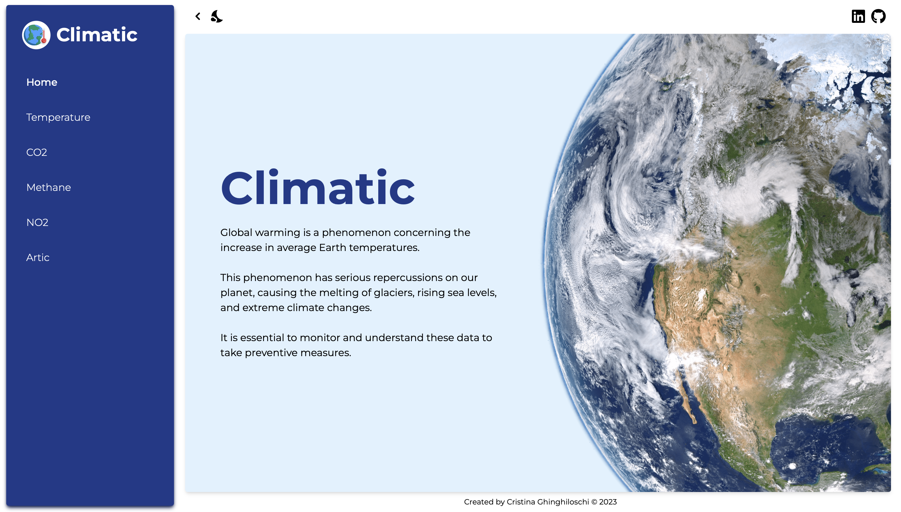
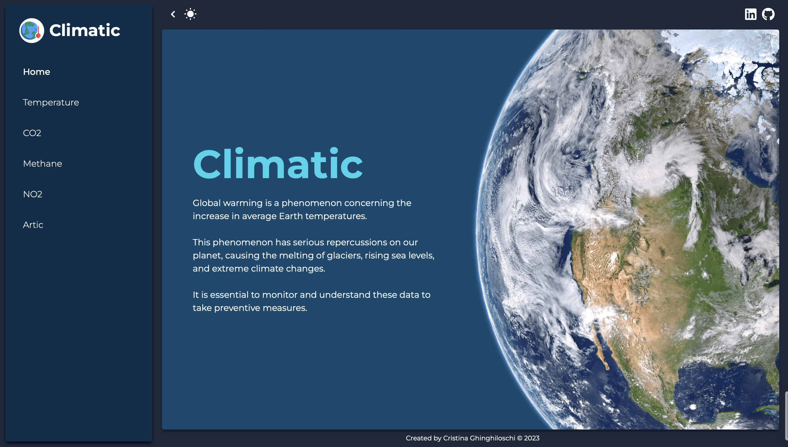
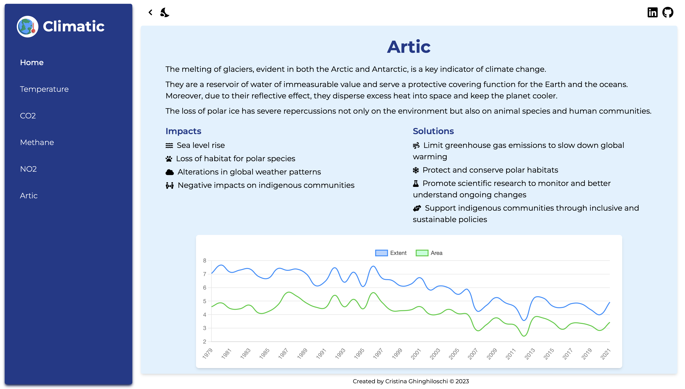
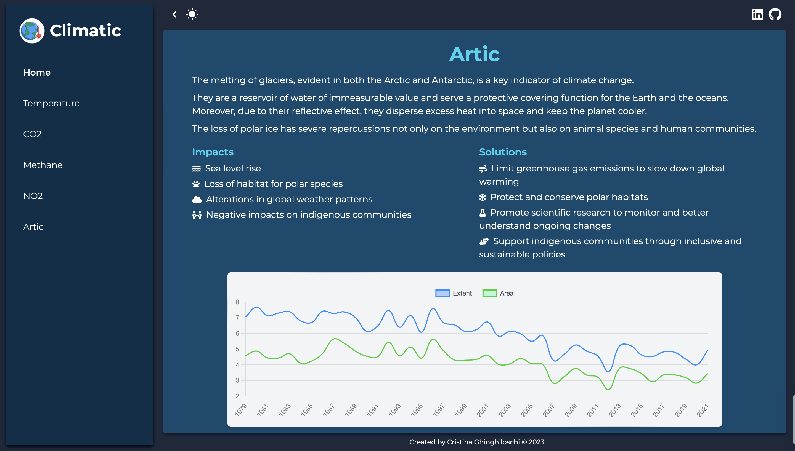

<h1 align="center">🚀 S2I • Final Project • Front End Development</h1>
<h3 align="left">Hello 👋, I'm Cris! 
I'm a student at Start2Impact University and I'm exited to present my final project for the Front End Development course.</h3>

For this project, I created multi-page dashboards to display data on global warming.</h3>
<h3 align="center">https://climatic-globalwarming.netlify.app</h3>

# Home
The main page of the site features an introductory section and a sidebar that allows users to select topics of interest.

  
  

# Example page
Each entry in the sidebar corresponds to a specific content, which includes a brief description of the topic, two lists pertaining to impacts and solutions, and finally a chart for data visualization.

  
  

### Languages
• HTML 
• CSS 
• [tailwindcss](https://tailwindcss.com) 
• [Chart.js](https://www.chartjs.org) 
• [Axios](https://axios-http.com) 
• [Font Awesome](https://fontawesome.com) 
• [React](https://react.dev) 

### Bundler 
[Vite](https://vitejs.dev)

### Webhost
[Netlify](https://www.netlify.com)
